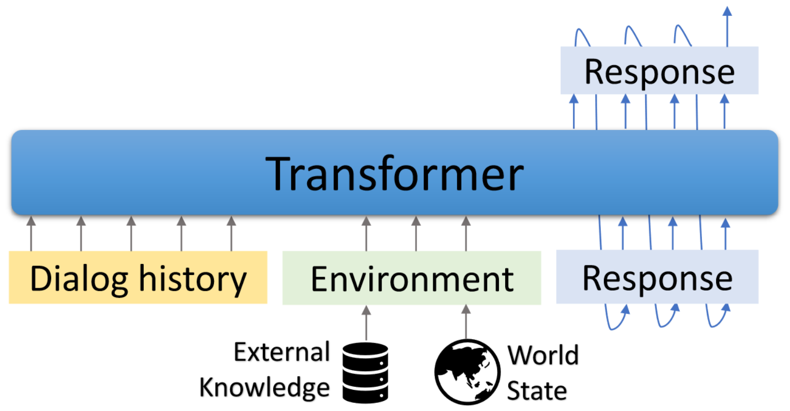

# GODEL: Large-Scale Pre-Training for Goal-Directed Dialog

## News

(Update 10/23/2022) We have released GODEL V1.1, which is trained on 551M multi-turn dialogs from Reddit discussion thread, and 5M instruction and knowledge grounded dialogs. It has shown significantly better results on our benchmark, especially in the zero-shot setting.

Please check out our model cards in the huggingface Transformers repository. With several lines of code, it should be pretty straightforward to chat with GODEL. A live demo is shown [here.](https://huggingface.co/spaces/microsoft/GODEL-Demo)

Base model: https://huggingface.co/microsoft/GODEL-v1_1-base-seq2seq

Large model: https://huggingface.co/microsoft/GODEL-v1_1-large-seq2seq

## Introduction
This repository showcases **building goal-directed dialog** using GODEL, and contains the dataset, source code and pre-trained model for the following paper:


[GODEL: Large-Scale Pre-Training for Goal-Directed Dialog](https://www.microsoft.com/en-us/research/publication/godel-large-scale-pre-training-for-goal-directed-dialog/)<br>Baolin Peng, Michel Galley, Pengcheng He, Chris Brockett, Lars Liden, Elnaz Nouri, Zhou Yu, Bill Dolan, Jianfeng Gao


GODEL is a large-scale pre-trained model for goal-directed dialogs. It is parameterized with a Transformer-based encoder-decoder model and trained for response generation grounded in external text, which allows more effective fine-tuning on dialog tasks that require conditioning the response on information that is external to the current conversation (e.g., a retrieved document). The pre-trained model can be efficiently fine-tuned and adapted to accomplish a new dialog task with a handful of task-specific dialogs.

This repository is based on Hugginface Transformers. Some evaluation scripts and dataset are adapted from [DSTC7-End-to-End-Conversation-Modeling](data/grounded), [DialoGPT](data/ungrounded), [UnifiedQA](https://github.com/allenai/unifiedqa), [MS MARCO](https://microsoft.github.io/msmarco/), [MultiWOZ](https://github.com/budzianowski/multiwoz), [Schema-Guided Dataset](https://github.com/google-research-datasets/dstc8-schema-guided-dialogue), etc.

The included scripts can be used to reproduce the results reported in the paper. Project and demo webpage: [https://aka.ms/GODEL](https://aka.ms/GODEL)

## Installation 
**Requires** The interactive interface requries *node.js* and *npm*. Please refer to [here](https://docs.npmjs.com/downloading-and-installing-node-js-and-npm) for installation.

Please use the below commands to create the environment, clone the repo and install required packages.
```
conda create -n godel-env python=3.8
conda activate godel-env
conda install nodejs
git clone https://github.com/microsoft/GODEL.git
cd GODEL
pip install -r requirements.txt
export PYTHONPATH="`pwd`"
```
Fetch and unzip the pretrained model based on which to continue finetune your own data.  

```zsh
wget https://bapengstorage.blob.core.windows.net/fileshare/godel_base.tar.gz
tar -zxvf godel_base.tar.gz
```
## Pipeline
**Data format**
```json
  {
    "Context": "Please remind me of calling to Jessie at 2PM.",
    "Knowledge": "reminder_contact_name is Jessie, reminder_time is 2PM",
    "Response": "Sure, set the reminder: call to Jesse at 2PM"
  },
```
We use json format to represent a training example. As shown in the above example, it contains the following fields:
* **Context** - The context from session beginning to current turn.
* **Knowledge** - External or environment state represented in plain text.
* **Reponse** - The target agent respose. It can be a template, an api call or natural language.

**Fine-tuning**
```Bash
DATA_NAME={path_of_data}
OUTPUT_DIR={path_of_fine-tuned_model}
MODEL_PATH={path_of_pre-trained_model}
EXP_NAME={experiment_name}

python train.py --model_name_or_path ${MODEL_PATH} \
	--dataset_name ${DATA_NAME} \
	--output_dir ${OUTPUT_DIR} \
	--per_device_train_batch_size=16 \
	--per_device_eval_batch_size=16 \
	--max_target_length 512 \
	--max_length 512 \
	--num_train_epochs 50 \
	--save_steps 10000 \
	--num_beams 5 \
	--exp_name ${EXP_NAME} --preprocessing_num_workers 24
```


**Generation**
```python
DATA_NAME={path_of_data}
OUTPUT_DIR={path_to_save_predictions}
MODEL_PATH={path_of_fine-tuned_model}

python generate.py --model_name_or_path ${MODEL_PATH}  \
	--dataset_name ${DATA_NAME}  \
	--output_dir ${OUTPUT_DIR}  \
	--per_device_eval_batch_size=16  \
	--max_target_length 128 \
	--max_length 512  \
	--preprocessing_num_workers 24  \
	--num_beams 5 
```

**Interaction**  

We provide a demo interface to chat with finetuned models. The backend server is based on *flask* and the interface is based on *vue*, *bootstrap-vue*, and *BasicVueChat*.

Start the backend server:
```bash
# Please create the backend server refering to e.g., dstc9_server.py
python EXAMPLE_server.py # start the sever and expose 8080 
```

Start serving frontend page:
```bash
cd GODEL/html
npm install
npm run serve 
```
Open localhost:8080 in your web browser, you will see the following page. Note that the backend port should be consistent with the port used in html/compoents/chat.vue.

A live demo is shown [here.](https://huggingface.co/spaces/microsoft/GODEL-Demo)

## Models

We have released GODEL V1.1, which is trained on 551M multi-turn dialogs from Reddit discussion thread and 5M instruction and knowledge-grounded dialogs. More models will be released later.

~~We have released three fine-tuned models which can be further fine-tuned on low-resource user-customized dataset. The total parameters in these models range from 117M to 2.7B.~~

| Model      | Huggingface Model Cards |
| :---: | :---: |
| Base      |  [microsoft/GODEL-v1_1-base-seq2seq](https://huggingface.co/microsoft/GODEL-v1_1-base-seq2seq)      |
| Large   |     [microsoft/GODEL-v1_1-large-seq2seq](https://huggingface.co/microsoft/GODEL-v1_1-large-seq2seq)    |


## Retraining full models

### Data preparation
GODEL is pre-trained with three phases 1) Linguistic pre-training on public web documents to gain the capability of text generation. 2) Dialog pre-training on public dialog data to learn to chat like a human. 3) Grounded dialog pre-training to enable a dialog model to generate responses grounding on specific goals.

The first phase is rather straightforward, i.e., initiating from any pre-trained LMs. The remaining phases require:

- Generating 27GB Reddit dataset, which involves downloading full Reddit submission and commnets dumps from https://files.pushshift.io/reddit creating intermediate files, which overall require 700GB of local disk space. Please follow this [repo](https://github.com/microsoft/DialoGPT) to prepare the data.

- Preparing grounded datasets including [DSTC7-End-to-End-Conversation-Modeling](https://github.com/mgalley/DSTC7-End-to-End-Conversation-Modeling), [UnifiedQA](https://github.com/allenai/unifiedqa), [MS MARCO](https://microsoft.github.io/msmarco/), [Schema-Guided Dataset](https://github.com/google-research-datasets/dstc8-schema-guided-dialogue). 

Prepare reddit data and specify its path in *create_reddit_dataset.sh*
```bash
cd scripts
./pretrain_data_preprocessing.sh
```

Downloading requried datasets and specify its path in *create_grounded_dataset.sh*
```bash
cd scripts 
./create_grounded_dataset.sh
```

### Pre-Training
```bash
# Reddit training
OUTPUT_DIR={path_to_save_predictions}
accelerate launch --config_file configs/G16_config.yaml train.py 
	--model_name_or_path t5-base \
	--dataset_name ./datasets_loader/reddit_dataset.py \
	--output_dir ${OUTPUT_DIR} \
	--per_device_train_batch_size=16 \
	--per_device_eval_batch_size=16 \
	--max_target_length 256 \
	--max_length 512 \
	--num_train_epochs 10 \
	--preprocessing_num_workers 24 \
	--num_beams 5 \
	--exp_name GODEL_reddit_training  \
	--learning_rate 5e-5 \	
	--save_every_checkpoint \
	--save_steps 50000

# Grounded training
REDDIT_CHECKPOINT={path_to_saved_checkpoint}
OUTPUT_DIR={path_to_save_predictions}
accelerate launch --config_file configs/G16_config.yaml train.py 
	--model_name_or_path ${REDDIT_CHECKPOINT} \
	--dataset_name ./datasets_loader/grounded_dataset.py \
	--output_dir ${OUTPUT_DIR} \
	--per_device_train_batch_size=16 \
	--per_device_eval_batch_size=16 \
	--max_target_length 256 \
	--max_length 512 \
	--num_train_epochs 10 \
	--preprocessing_num_workers 24 \
	--num_beams 5 \
	--exp_name GODEL_reddit_training  \
	--learning_rate 5e-5 \
	--save_every_checkpoint \
	--save_steps 50000
```

### Fine-tuning and Evaluation

GODEL is fine-tuned and evaluated on four tasks. We provide scripts to create training and testing data in our format. Please refer to *create_downstream_dataset.sh* to download the original data and execute the following cmd.

```Bash
cd scripts 
./create_downstream_dataset.sh
```

```Bash
GROUNDED_CHECKPOINT={path_to_saved_checkpoint}
OUTPUT_DIR={path_to_save_predictions}
TASK=wow
accelerate launch --config_file configs/G16_config.yaml train.py 
	--model_name_or_path ${GROUNDED_CHECKPOINT} \
	--dataset_name ./datasets_loader/${TASK}_dataset.py \
	--output_dir ${OUTPUT_DIR} \
	--per_device_train_batch_size=16 \
	--per_device_eval_batch_size=16 \
	--max_target_length 256 \
	--max_length 512 \
	--num_train_epochs 10 \
	--preprocessing_num_workers 24 \
	--num_beams 5 \
	--exp_name ${TASK}  \
	--learning_rate 5e-5 \	
	--save_every_checkpoint \
	--save_steps 50000 
```

## Tutorial - Adding a new task using GODEL

In this tutorial, you will build a grounded dialog model based on GODEL for DSTC9 task. Detailed information can be found at [here](https://github.com/alexa/alexa-with-dstc9-track1-dataset).

Firstly download the data and convert it to GODEL format.
```bash
cd examples/dstc9
./create_data.sh
```
*Finetune with the pre-trained GODEL model*
```bash
cd GODEL 
GODEL_MODEL={path_to_pre-trained_model}
python train.py 
	--model_name_or_path ${GODEL_MODEL}   \
	--dataset_name ../examples/dstc9/dstc9_dataset.py   \
	--output_dir ../examples/dstc9/ckpt   \
	--per_device_train_batch_size=16  \
	--per_device_eval_batch_size=16  \
	--max_target_length 128  \
	--max_length 512  \
	--num_train_epochs 50  \
	--save_steps 10000  \
	--num_beams 5  \
	--exp_name wow-test \
	--preprocessing_num_workers 24 \
	--save_every_checkpoint 
```
*Interact with above trained model*
```bash
cd examples/dstc9
# replace model path in dstc9_server with a trained ckpt in line 49
python dstc9_server.py

cd GODEL/html 
npm install
npm run serve
```

## Disclaimer
This repository aims to facilitate research in a paradigm shift of building task bots at scale. This toolkit contains only part of the modeling machinery needed to actually produce a model weight file in a running dialog. On its own, this model provides only information about the weights of various text spans; in order for a researcher to actually use it, they will need to bring in-house conversational data of their own for future pre-training and decode the response generation from the pretrained/finetuned system. Microsoft is not responsible for any generation from the 3rd party utilization of the pretrained system.

<!-- ## Contact
Should you have any questions/suggestions, feel free to contact bapeng@microsoft.com. -->

## Citation
if you use this code and data in your research, please cite our arxiv paper:
```
@misc{peng2022godel,
author = {Peng, Baolin and Galley, Michel and He, Pengcheng and Brockett, Chris and Liden, Lars and Nouri, Elnaz and Yu, Zhou and Dolan, Bill and Gao, Jianfeng},
title = {GODEL: Large-Scale Pre-training for Goal-Directed Dialog},
howpublished = {arXiv},
year = {2022},
month = {June},
url = {https://www.microsoft.com/en-us/research/publication/godel-large-scale-pre-training-for-goal-directed-dialog/},
}
```


<!-- # Project

> This repo has been populated by an initial template to help get you started. Please
> make sure to update the content to build a great experience for community-building.

As the maintainer of this project, please make a few updates:

- Improving this README.MD file to provide a great experience
- Updating SUPPORT.MD with content about this project's support experience
- Understanding the security reporting process in SECURITY.MD
- Remove this section from the README -->

## Contributing

This project welcomes contributions and suggestions.  Most contributions require you to agree to a
Contributor License Agreement (CLA) declaring that you have the right to, and actually do, grant us
the rights to use your contribution. For details, visit https://cla.opensource.microsoft.com.

When you submit a pull request, a CLA bot will automatically determine whether you need to provide
a CLA and decorate the PR appropriately (e.g., status check, comment). Simply follow the instructions
provided by the bot. You will only need to do this once across all repos using our CLA.

This project has adopted the [Microsoft Open Source Code of Conduct](https://opensource.microsoft.com/codeofconduct/).
For more information see the [Code of Conduct FAQ](https://opensource.microsoft.com/codeofconduct/faq/) or
contact [opencode@microsoft.com](mailto:opencode@microsoft.com) with any additional questions or comments.

## Trademarks

This project may contain trademarks or logos for projects, products, or services. Authorized use of Microsoft 
trademarks or logos is subject to and must follow 
[Microsoft's Trademark & Brand Guidelines](https://www.microsoft.com/en-us/legal/intellectualproperty/trademarks/usage/general).
Use of Microsoft trademarks or logos in modified versions of this project must not cause confusion or imply Microsoft sponsorship.
Any use of third-party trademarks or logos are subject to those third-party's policies.
